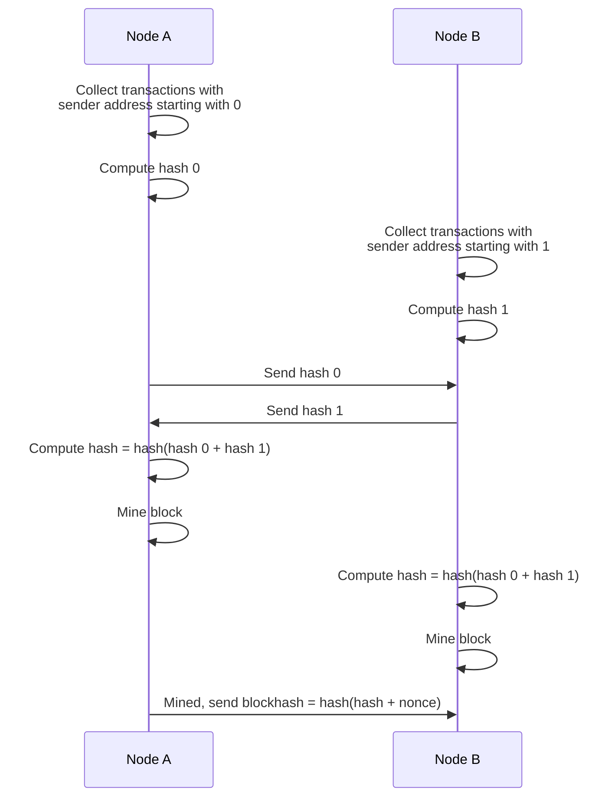
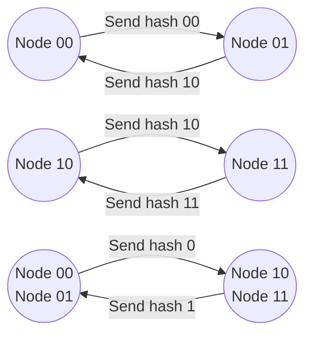
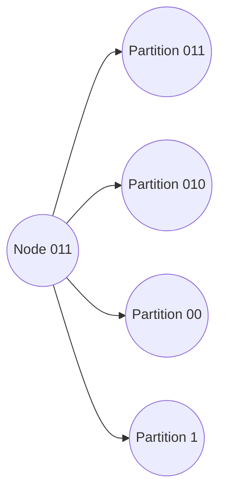

# Distributed Hash Chain
Distributed hash chain or DHC is an extension of blockchain structure first implemented in [Bitcoin](https://bitcoin.org/bitcoin.pdf). Bitcoin and many other blockchains suffer from scalability problem. Bitcoin on average can process only between 3.3 and 7 transactions per second which makes it unsuitable as a currency as people cannot do many transactions and transaction fees get very high. In comparison VISA processes thousands transactions per second. The main reason is that every node on the Bitcoin network needs to receive and keep a copy of every transaction. The goal of DHC is to improve scalability of a traditional blockchain.

One approach to improve scalability is to use sharding where instead of a single blockchain there are multiple blockchains that store different sets of transactions and they are synchronized between each other in some way.

DHC has a single blockchain, but each node only stores a subset of transactions in a given block so it can process them as quickly as possible without any bottleneck inherent in traditional blockchains. When more nodes join the DHC network the partitions of transactions split further so each node processes similar number of transactions as before the split.

Imagine there are two nodes A and B. Address of node A in binary form starts with 0 and address of node B in binary form starts with 1. Then node A will start collecting all pending transactions from senders which address start with 0 and node B will start collecting all pending transactions from senders which address start with 1. Node A will not even receive transactions from senders which address start with 1 thus reducing network traffic. Similarly for node B. How A and B can work together and create a distributed block? Here are the steps.

 1. Node A creates hash of transactions it collected and sends that hash to node B
 2. Node B creates hash of transactions it collected and sends that hash to node A
 3. Both nodes produce combined hash in the same order. First hash from A then hash from B, since address of A starts with 0 and address of B starts with 1.
 4. Both nodes start mining using the same combined hash

When there are more nodes the same approach applies. Any node with address starting with 0 needs to combine hash of transaction it collected with a hash it receives from a node with address starting with 1. It needs to broadcast that information to other nodes on the same partition so they would be able to recover that information once they receive mined block even if that node goes down. To reduce the number of these broadcasts and consequently the number of combinations with other partitions, nodes are required to include small proof of work.

How would we deal with a case when there are $2^2 = 4$ partitions? Now we have 4 nodes that have addresses in binary form starting with 00, 01, 10, 11. It is happening as following.

 1. Nodes on 00 partition collect transactions and exchange hashes with nodes on 01 partition, creating hash 0
 2. Nodes on 10 partition collect transactions and exchange hashes with nodes on 11 partition, creating hash 1
 3. Nodes on 00, 01 partitions (combined partition 0) send hash 0 to nodes 10, 11
 4. Nodes on 10, 11 partitions (combined partition 1) send hash 1 to nodes 00, 01
 5. All nodes combine hashes 0 and 1 and start mining

In steps 3 and 4 hashes 0, 1 include small proof of work to reduce the number of combinations. Transactions are never sent to nodes on other partitions, only hashes. Nodes would only need to be connected to some other nodes on its own partition and on opposite partitions. For example Node 00 needs to be connected to some nodes on partition 00 and 01 and some nodes on partition 1 (combination of partitions 10 and 11).

We would call index length of a partition **power**. Partition 00 has power 2 and partition 110 has power 3.

This approach is easily extended when there are $2^n$ partitions. The number of steps would increase but not by much. There will be 10 steps to create combined hash for about a thousand partitions, 20 steps for about a million partitions, 30 steps for a billion partitions. If each step takes 1 second on the network then nodes on a billion partition network can create combined hash in 30 seconds.

All nodes connect to each other in a [Kademlia](http://pdos.csail.mit.edu/~petar/papers/maymounkov-kademlia-lncs.pdf) like network. The difference from Kademlia is that DHC uses TCP instead of UDP and it keeps k-bucket containing its own node (partition) at the same power (index length) without splitting it even if there are many nearby nodes. This is done to mitigate eclipse attacks. In our current implementation k = 8 as in BitTorrent Mainline DHT. Please notice that DHC is not a distributed hash table and only uses Kademlia like network to connect to other nodes.

Below is an example of Node 001, whose address starts with 001 in binary form, connecting to nodes in required partitions. Since k = 8, the node maintains connections to 8 nodes in each partition.

DHC also implements dynamic partitioning. As more nodes join, partitions split and the number of them increases as the network grows. If enough nodes leave the network then leaf partitions merge automatically. This way nodes on average process and store similar number of transaction in a given time period.

## Installations

Installation instructions for full version:

1. Install Java version 8 or 9
2. Download installer from this <a href="https://drive.google.com/file/d/1QeGQoQCzm0wR4zcNhhS3duOIlLR6Kphh/view?usp=sharing" target="_blank" download="dhc-installer">Download</a> link.
3. Follow installer instructions and install in a directory where you have full access.
4. If you already have key.csv file with existing keys you can just copy it to keys folder, otherwise it will create new key. 
5. Start it by running dhc.sh or dhc.bat depending on your operating system. For graphical version run dhcgui.sh or dhcgui.bat

It will ask you to enter passphrase and confirm it. In case you have existing key it will ask you to enter passphrase for it.

Installation instructions for light GUI client for Windows, LINUX, Mac: <a href="https://bitbucket.org/dhchain/dhcclient/src/master/">Lite DHC Client</a>

Installation instructions for for Android client: <a href="https://bitbucket.org/dhchain/dhcandroid/src/master/">Android DHC Client</a>

	Contact: admin@dhcne.org

